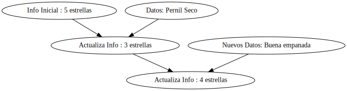
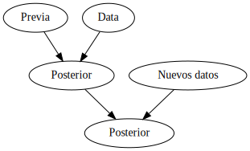
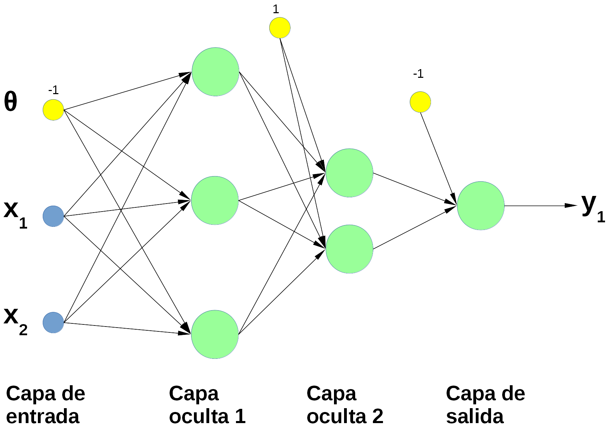

```{r setup, include=FALSE}
knitr::opts_chunk$set(echo = FALSE)
```

<!--
```
# Instalar previamente graphviz en GNU/Linux: sudo apt-get install -y graphviz
#install.packages("bnlearn")
#install.packages("BiocManager")
#BiocManager::install("Rgraphviz")

#library(bnlearn)
```
-->

# Introducción
La Inteligencia Artificial tiene varios sub-campos, entre los que podemos destacar los que se indican a continuación [3]:

- Las redes neuronales artificiales (modelado del cerebro, predicción, clasificación, series temporales, entre otras).
- Computación evolutiva (algoritmos genéticos, programación genética)
- Visión por computador (reconocimiento de objetos, interpretación de imágenes, entre otros)
- Robótica (control inteligente, exploración autónoma, etc.)
- Sistemas expertos (sistemas de soporte a la toma de decisiones, sistemas de enseñanza)
- Procesamiento del lenguaje natural (traducción automática)
- Planeación (juegos, programación de actividades)
- Procesamiento del habla (reconocimiento automático del habla)
- Aprendizaje de máquina (aprendizaje de árboles de decisión)


Sin embargo, en este curso nos centraremos en 3 tópicos de gran relevancia que servirán como un pilar para el estudio y desarrollo de posteriores áreas:

- Teoría Bayesiana (Redes Bayesianas) como un elemento de gran interés en el ámbito de los sistemas expertos.
- Redes Neuronales como una herramienta para realizar diversas tareas, sin dejar de lado temas innovadores como el *deep learning* (aprendizaje profundo).
- Lógica Difusa como una herramienta del control inteligente.


# Teoría Bayesiana

Los seres humanos vamos actualizando nuestro conocimiento acerca del mundo a medida que pasa el tiempo, es decir, vamos acumulando **experiencias vividas** o **recolectando datos** [1].

Por ejemplo, suponga que se inaugura un nuevo restaurante de comida tradicional en su ciudad. Según las calificaciones de los usuarios en *Google Local Guides* <https://maps.google.com/localguides/> es un resaturante **5 estrellas**, y asume que la comida será exquisita. En la primera visita pide un hornado y este viene muy seco. Con esta situación, Usted actualiza su conocimiento y pasa a considerar al restaurante como de **3 estrellas**. Sin embargo, decide darle una nueva oportunidad, y en una siguiente visita pide empanadas y estas resultan de excelente sabor. Con ello decide actualizar su conocimiento y pasa a considerar al restaurante como de **4 estrellas**.  Con ello, seguirá recopilando datos cada vez que siga visitando el restaurante, y al mismo tiempo, estará actualizando su conocimiento [1].

<!--

```
#ejem.restaurante <- model2network('[Info inicial - 5 estrellas][Data - pernil seco][Actualiza info - 3 estrellas|Info inicial - 5 estrellas:Data - pernil seco]')
#par(cex=0.05)
#graphviz.plot(ejem.restaurante, highlight = 
#                list(nodes=nodes(ejem.restaurante), fill="lightgreen", col="black"))

```
-->

{width=80%}

De este modo, lo que se aprecia en la Figura 1 representa el proceso natural de construcción del conocimiento *Bayesiano*, considerando las ideas preconcebidas [1].

Es importante observar que este proceso Bayesiano se puede aplicar a investigaciones rigurosas en diversos campos científicos. Por ejemplo, si una persona realiza investigación en el ámbito educativo, estará interesada en conocer cómo influyen diferentes factores como la alimentación, las horas de sueño, el tiempo de estudio, etc. en el rendimiento académico del estudiante. Sin embargo, para realizar esta investigación se parte de *conocimento previo* (previa), y con ayuda de dicho conocimiento se interpretan los *nuevos datos*, sopesando la información *posterior* (Figura 2)  [1].

{width=50%}


Las Redes Bayesianas se aplican en una gran cantidad de ámbitos de la ciencia. Algunos de los ejemplos más destacados son los que se indican seguidamente [2]:

- Diagnóstico médico (se generan hipótesis para cada enfermedad que tiene el paciente dado un conjunto de observaciones de síntomas).
- Genética (se emplean Redes Bayesianas para modelar la base un rasgo complejo y para modelar fenotipos complejos).
- Análisis de factores de riesgo delictivo (se emplean Redes Bayesianas para tratar de explicar aspectos relacionados con los crímenes que cometen las personas). 
- Clasificación de documentos (identificar a que clase o clases pertenece un documento en base a su contenido).
- Busca semántica (realizar búsquedas entiendo el contexto del contenido).


# Redes Neuronales

Las Redes Neuronales Artificiales (RNA) son modelos matemáticos que buscan reproducir la forma como funciona el sitema nervioso de un ser humano. Las RNA contienen miles de nodos (neuronas) que están altamente conectados entre sí (Figura 3)

{width=50%}


Las RNA son capaces de realizar diversas tareas gracias a un proceso de entrenamiento previo [4]:

- Predicción de eventos y simulación (dado un conjunto de datos previos la red puede determinar nuevos valores, por ejemplo, consumo de energía eléctrica, ventas, etc.)
- Reconocimiento y clasificación (asociar patrones de entrada a clases determinadas).
- Reconocimiento automático del habla (se combinan con otros modelos para reconocer comandos de voz).

En la actualidad se cuenta con herramientas muy potentes como el aprendizaje profundo, que es capaz de generar cuadros, crear códigos en diversos lenguajes de programación, crear composiciones musicales, conducir vehículos, alimentar chatbots, entre otras tantas aplicaciones.

# Lógica Difusa

La lógica difusa fue introducida en los años 60 por el investigador Lofti A. Zadeh a fin de modelar el conocimiento humano desde una perspectiva de la información imprecisa e incompleta. Con ello, es posible construir reglas a partir de la definición de términos vagos (imprecisos) [5].

Por ejemplo, en la Figura 4 se puede apreciar un ejemplo de un sistema para análisis de navegación de múltiples robots humanoides utilizando un enfoque de control de lógica difusa-regresión híbrida en terrenos complejos [6]:

![Figura 4. Sistema para análisis de navegación de robots humanoides [6]](./images/Humanoid-Navigation-Fuzzy-Logic.png)


La Lógica Difusa se aplica en diversos ámbitos, algunos de los más destacados son los que se indican seguidamente [5]:

- Control difuso: para el control de electrodomésticos (máquinas de lavado de ropa, microondas, tostadoras, aspiradoras, etc.). Asimismo, se ha aplicado con éxito a la *estabilización* del lente de cámaras cuando existen movimientos por parte del soporte de las mismas. 
- Procesamiento de imágenes: en el mejoramiento de la calidad de imágenes, clasificación de imágenes, detección de objetos en imágenes, entre otras.
- Soporte a la toma de decisiones: en esta área se han desarrollado sistemas expertos basados en razonamiento incierto (o lógica difusa) para diagnóstico médico, planeación, negociación de divisas y selección de estrategias comerciales.


# Computación Evolutiva
La computación evolutiva busca emular el proceso de la selección natural que se describe en la teoría de evolución de las especies, propuesta por Charles Darwin [7]. En la naturaleza, los organismos tienen ciertas características que influencian su habilidad para sobrevir en entornos adversos y heredar a sus descendientes estas habilidades a través del código genéticos. Con ello, la progenie será capaz de hacer frente a estos entornos adversos, ya que hereda estas habilidades [6].

El proceso de selección natural se asegura de que los individuos más idóneos tendrán más oportunidades de reproducirse, tratando de garantizar que la descendencia tendrá un nivel de condición física similar o superior [6].


<!--

```{r, echo=TRUE}
library(reshape2)
library(ggplot2)
tam <- 5
mx <- matrix(rep(c(0, 1), tam), nrow=tam, ncol=tam)
ggplot(melt(mx), aes(x=Var1, y=Var2, fill=value)) + geom_tile() + 
  scale_fill_gradientn(colours = c('cornsilk', 'gray37'), values = c(0,1)) + 
  theme(legend.position = 'none', axis.title.x = element_blank(), axis.title.y = element_blank())
```

-->

A continuación se presenta un ejemplo de un algoritmo genético para minizar una la siguiente función $z = x^{2} + y^{2}$:


```{r, echo=TRUE}
x <- seq(-3, 3, length.out = 100)
y <- seq(-3, 3, length.out = 100)
z <- outer(x^2, y^2, `+`)
persp(x, y, z, col='yellow')
```

Se le solicita usar un algoritmo genético para encontrar el par de puntos $x$, $y$ que permitan obtener el valor mínimo de $z$.

Para ello, podemos aplicar el siguiente código que buscará el par de valores $x$, $y$ que minimizará $z$.

```{r  message=FALSE, warning=FALSE, echo=TRUE}
# Partimos de dos valores aleatorios de x, y
x <- runif(1, -3, 3)
y <- runif(1, -3, 3)
sprintf('x: %2.2f', x)
sprintf('y: %2.2f', y)
```

Con estos valores se obtiene el siguiente valor para $z$:

```{r message=FALSE, warning=FALSE, echo=TRUE}
z <- x^2+y^2
sprintf('z: %2.2f', z)
```

```{r}
#install.packages('genalg')
```


```{r, warning=FALSE, message=FALSE, echo=TRUE}
library(genalg)
evaluate <- function(string=c()) {
        returnVal = NA;
        if (length(string) == 2) {
                returnVal =string[1]^2+string[2]^2;
        } else {
                stop("Expecting a chromosome of length 2!");
        }
        returnVal
}
monitor <- function(obj) {
        # plot the population
        xlim = c(obj$stringMin[1], obj$stringMax[1]);
        ylim = c(obj$stringMin[2], obj$stringMax[2]);
        plot(obj$population, xlim=xlim, ylim=ylim,
             xlab="x", ylab="y");
}

rbga.results = rbga(c(-3, -3), c(3, 3),
                    evalFunc=evaluate, verbose=FALSE, mutationChance=0.1)

plot(rbga.results)
#plot(rbga.results, type="hist")
#plot(rbga.results, type="vars")

print(rbga.results$best)
```

Como se observa, para el caso de esta sencilla función, se ha encontrado que los mejores valores para las variables $x$, $y$ es un valor cercano a $0$ en ambos casos.


Los algoritmos genéticos se emplean para contribuir a la solución de diferentes tipos de problemas. Algunas de las aplicaciones más destacas son las que se mencionan a continuación :

- Medicina: en el ámbito médico los algoritmos genéticos se han empleado para brindar soporte en la radiología (detección de bordes en imágenes adquiridas con aparatos de ultrasonido, tomografía computarizada e imágenes de resonancia magnética, mejora en la detección de cáncer de mama, etc.), la cardiología (interpretación automágica de electrocardiogramas, estimación de parámetros para y variables para prevención de infarto de miocardio en pacientes con dolor torácico, etc), entre otros [8].
- Minería de datos: para reconocimiento de patrones en el campo de la minería de datos [9]. 
- Acústica: para distinguir la reflexión de señales de sonar y diferentes tipos de objetos [9].
- Sistemas de manufactura: minimización de costo utilizando el conjunto optimizado de parámetros. El objetivo detrás de la aplicación de la optimización genética es obtener un plan de producción que sea óptimo teniendo en cuenta las condiciones dinámicas como los inventarios, la capacidad o la calidad del material [9].

# Ventajas y limitaciones de la Inteligencia Artificial
La Inteligencia Artificial, como cualquier técnica, tiene ventajas y limitaciones. A continuación se listan algunas de las ventajas más importantes de esta rama [10]:

- Ayudan a reducir el "error humano". Los seres humanos pueden cometer errores de tiempo a tiempo, sin embargo, las máquinas son menos propensas a ello. Por ejemplo, una aplicación exitosa donde se ha reducido el error humano es en la previsión del clima.
- Disponibilidad 24x7 (24 horas al día, 7 días a la semana), capacidad para asumir riesgos (robots que realicen actividades de riesgo en lugar de personas), capacidad para tomar decisiones mucho más rápido.
- Nuevos inventos (la Inteligencia Artificial está permitiendo realizar nuevos inventos en diversas áreas con el objetivo de ayudar a las personas a resolver problemas complejos, por ejemplo, los doctores hoy en día han podido predecir casos de cáncer de mama en mujeres en etapas tempranas usando técnicas de IA)


Entre las limitaciones de la Inteligencia Artificial se pueden mencionar las siguientes [10]:

- Una de las mayores críticas que se hacen a la IA es que algunas de sus técnicas aún son vistas como "cajas negras" (en especial las redes neuronales), ya que no se puede deducir de forma clara las relaciones entre las variables.
- Otra limitación de los métodos de búsqueda basados en IA, como los algoritmos genéticos y la optimización de colonias de hormigas, es que nunca se garantiza que lleguen a la solución "óptima".
- Una tercera limitación es que al tratar de resolver un problema dado es que actualmente existe poca orientación sobre cómo decidir los mejores valores para usar para los parámetros de ajuste de un método dado.


# Referencias
1. Johnson, A. A., Ott, M. Q., & Dogucu, M. (2022). Bayes Rules!: An Introduction to Applied Bayesian Modeling. CRC Press.
2. Pourret, O., Na, P., & Marcot, B. (Eds.). (2008). Bayesian networks: a practical guide to applications. John Wiley & Sons.
3. Ertel, W. (2018). Introduction to artificial intelligence. Springer.
4. Nunes da Silva, I., Hernane Spatti, D., Andrade Flauzino, R., Bartocci Liboni, L. H., and dos Reis Alves, S. F. (2017). Artificial Neural Networks : A Practical Course. Springer International Publishing, 1 edition.
5. Siddique, N., & Adeli, H. (2013). Computational intelligence: synergies of fuzzy logic, neural networks and evolutionary computing. John Wiley & Sons.
6. Kumar, P. B., Muni, M. K., & Parhi, D. R. (2020). Navigational analysis of multiple humanoids using a hybrid regression-fuzzy logic control approach in complex terrains. Applied Soft Computing, 89, 106088.
7. Darwin, C. (2004). On the origin of species, 1859. Routledge.
8. Ghaheri, A., Shoar, S., Naderan, M., & Hoseini, S. S. (2015). The applications of genetic algorithms in medicine. Oman medical journal, 30(6), 406.
9. Vanneschi, L., Silva, S., Castelli, M., & Manzoni, L. (2014). Geometric semantic genetic programming for real life applications. In Genetic programming theory and practice xi (pp. 191-209). Springer, New York, NY.
10. Kumar, S. (2019, December 12). Advantages and disadvantages of Artificial Intelligence. Medium. Retrieved April 11, 2022, from https://towardsdatascience.com/advantages-and-disadvantages-of-artificial-intelligence-182a5ef6588c 
11. Chowdhury, M., & Sadek, A. W. (2012). Advantages and limitations of artificial intelligence. Artificial intelligence applications to critical transportation issues, 6(3), 360-375.